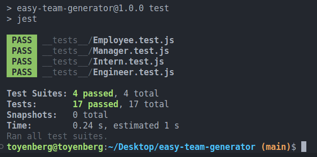
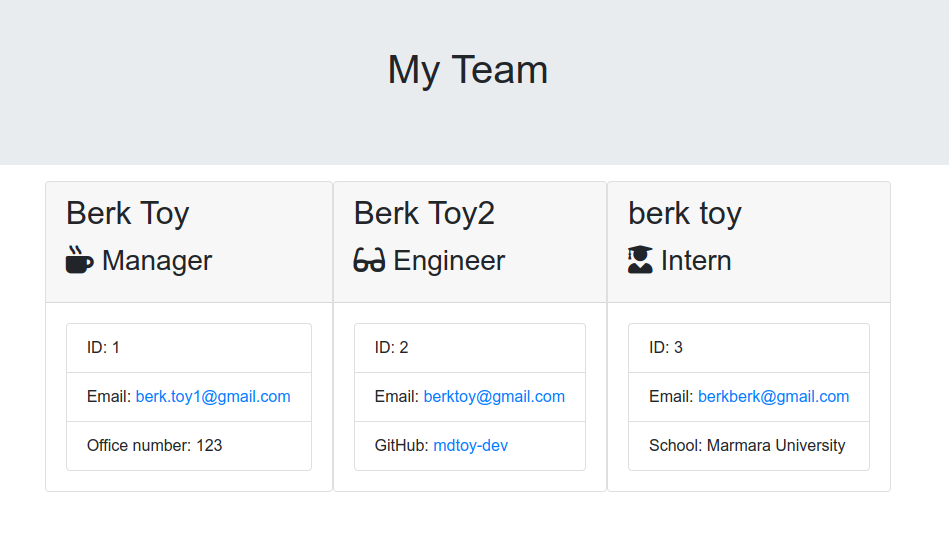

# Easy Team Generator
  
  ## Table of Contents
  * [Description](#Description)
  * [Installation](#Installation)
  * [Usage](#Usage)
  * [License](#License)
  * [Contributing](#Contributing)
  * [Test](#test)
  * [Questions](#questions)

  ## Description 
  Generate a webpage that displays your team's basic information so that a user have quick access to their emails and GitHub profiles.

  ## Installation
  All the necessary dependencies are listed in the package.json file. You only need to copy the repository and type ```npm install``` to generate download packages.

  ## Usage
  ```node index.js``` to start questionairre.

  ## License
  [](https://opensource.org/licenses/MIT)

  ## Contributing
  If you want to contribute please fork, make your additions and create a pull request.
  
  ## Test
  Run ```npm run test``` to perform unit testing included in the application. 

  ### ScreenShot of a successful test run.

  

  

  

 
   
  ## Questions
  Check my [GitHub Profile](https://github.com/mdtoy-dev) or get in touch if you have any questions by sending me an [email](mailto:berk.toy1@gmail.com).

  